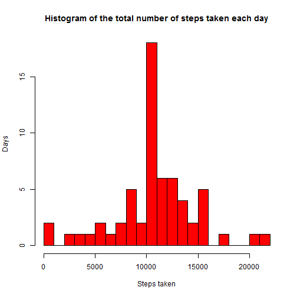
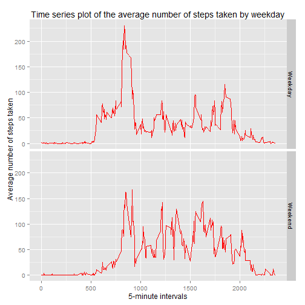

#Loading and preprocessing the data

##Loading the data (i.e. read.csv())


```r
data<-read.csv('activity.csv')
require("dplyr")
```

```
## Loading required package: dplyr
```

```
## Warning: package 'dplyr' was built under R version 3.2.2
```

```
## 
## Attaching package: 'dplyr'
## 
## The following objects are masked from 'package:stats':
## 
##     filter, lag
## 
## The following objects are masked from 'package:base':
## 
##     intersect, setdiff, setequal, union
```

```r
require('ggplot2')
```

```
## Loading required package: ggplot2
```

```
## Warning: package 'ggplot2' was built under R version 3.2.2
```

#What is mean total number of steps taken per day?

##Histogram of the total number of steps taken each day

```r
group_by_date<-group_by(data, date)
T_steps<-summarise(group_by_date, steps_day=sum(steps, na.rm = TRUE))
hist(T_steps$steps_day, breaks=20, main='Total number of steps taken each day', xlab="Steps taken", ylab="Days",col='red')
```

 

##The mean and median total number of steps taken per day

```r
m_m<-summarise(T_steps,mean_steps_day=mean(steps_day, na.rm=TRUE), median_steps_day=median(steps_day,na.rm=TRUE))
print(m_m)
```

```
## Source: local data frame [1 x 2]
## 
##   mean_steps_day median_steps_day
##            (dbl)            (int)
## 1        9354.23            10395
```
#What is the average daily activity pattern?

##Time series plot (i.e. type = "l") of the 5-minute interval (x-axis) and the average number of steps taken, averaged across all days (y-axis)

```r
group_by_interval <- group_by (data, interval)
Average_steps<- summarise(group_by_interval, avrg_steps=mean(steps, na.rm=TRUE))
plot(Average_steps$interval, Average_steps$avrg_steps, type = "l", ylab = " Average number of steps taken", xlab = "5-minute intervals",col='red')
```

 

##5-minute interval with the maximum number of steps.

```r
filter(Average_steps,avrg_steps==max(avrg_steps))
```

```
## Source: local data frame [1 x 2]
## 
##   interval avrg_steps
##      (int)      (dbl)
## 1      835   206.1698
```
#Imputing missing values

##Total number of missing values in the dataset.

```r
length(data[is.na(data)])
```

```
## [1] 2304
```

Adding mean value of corresponding 5-minute interval to the missing value rows.

##Create a new dataset that is equal to the original dataset but with the missing data filled in.

```r
new_data<-data
new_data<-merge(new_data,Average_steps)
new_data$steps<-replace(new_data$steps,is.na(new_data$steps),new_data$avrg_steps[is.na(new_data$steps)])
```

##Histogram of the total number of steps taken each day and Calculate and report the mean and median total number of steps taken per day. 

```r
group_date<-group_by(new_data, date)
t_steps<-summarise(group_date, steps_day=sum(steps, na.rm = TRUE))
hist(t_steps$steps_day,breaks=20, main='Histogram of the total number of steps taken each day', xlab='Steps taken', ylab='Days',col='red')
```

 

```r
M_M<-summarise(t_steps,mean_steps_day=mean(steps_day, na.rm=TRUE), median_steps_day=median(steps_day,na.rm=TRUE))
print(M_M)
```

```
## Source: local data frame [1 x 2]
## 
##   mean_steps_day median_steps_day
##            (dbl)            (dbl)
## 1       10766.19         10766.19
```

##Do these values differ from the estimates from the first part of the assignment? What is the impact of imputing missing data on the estimates of the total daily number of steps?
Yes, as compared to orginal dataset mean has increased from 9354.2295082 to 1.0766189 &times; 10<sup>4</sup>  and median has increased from 10395 to 1.0766189 &times; 10<sup>4</sup>. Moreover median and mean both have same values now.

#Are there differences in activity patterns between weekdays and weekends?

##Plot containing a time series plot (i.e. type = "l") of the 5-minute interval (x-axis) and the average number of steps taken, averaged across all weekday days or weekend days (y-axis). 

```r
new_data$wd<-weekdays(as.Date(new_data$date),abbreviate = TRUE)
new_data$wd<-replace(new_data$wd,new_data$wd=='Sun'|new_data$wd=='Sat','Weekend')
new_data$wd<-replace(new_data$wd,new_data$wd=='Mon'|new_data$wd=='Tue'|new_data$wd=='Wed'|new_data$wd=='Thu'|new_data$wd=='Fri','Weekday')
new_data$wd<-as.factor(new_data$wd)
group_interval_wd<- group_by (new_data, interval,wd)
Average_Steps<- summarise(group_interval_wd, avrg_steps=mean(steps, na.rm=TRUE))
ggplot (Average_Steps, aes(interval, avrg_steps))+
        geom_line(size=.7, position="identity",color="red")+
        facet_grid(wd ~ .)+
        ggtitle ("Time series plot of the average number of steps taken by weekday")+
        xlab("5-minute intervals")+
        ylab(" Average number of steps taken")
```

 
